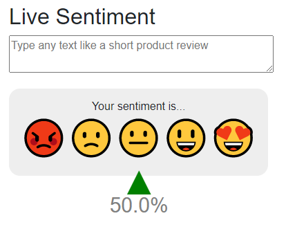
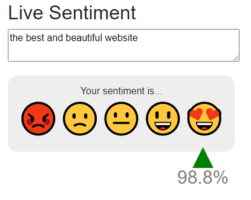
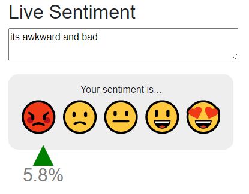

# ML.NET-LiveSentimentAnalysis
Blazor ML.NET LiveSentimentAnalysis  
This is an example of binary classification of ML.NET  which processes user feedback live while typing.
The <a href=https://raw.githubusercontent.com/ymg2006/ML.NET-LiveSentimentAnalysis/master/wikiDetoxAnnotated40kRows.tsv>wikipedia's detox data</a> is used for training the system.

  
  
  

